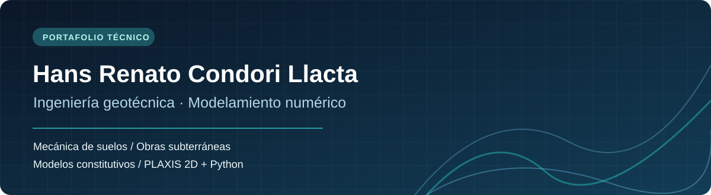

  
    
  <strong>Apuntes técnicos · Investigación académica · Modelamiento numérico</strong>
    
  <a href="#presentaciones">Presentaciones</a> · <a href="#códigos">Códigos</a> · <a href="#investigación-académica">Investigación</a>

---

## Hola, soy Hans 👋

Me interesan la **ingeniería geotécnica**, las **obras subterráneas** y el **modelamiento numérico**. Este repositorio reúne mis materiales personales de estudio y proyectos académicos: una colección en desarrollo que conecta fundamentos de mecánica del continuo, comportamiento del terreno y aplicaciones computacionales.

> **Enfoque:** comprender los fundamentos físicos de cada análisis, justificar los parámetros adoptados e interpretar los resultados más allá del software.

## Presentaciones

Apuntes técnicos y presentaciones en **PDF**, organizados para su consulta. Las versiones convertidas están preparadas y pendientes de subir al repositorio.

| N.º | Tema |
|:--:|:--|
| 01 | Introducción a elementos finitos |
| 02 | Mecánica del medio continuo |
| 03 | Teoría de la elastoplasticidad |
| 04 | Comportamiento del suelo |
| 05 | Modelos constitutivos |
| 06 | PLAXIS: elementos estructurales |
| 07 | Introducción a PLAXIS |

**[Explorar la sección Presentaciones →](Presentaciones/README.md)**

## Códigos

Scripts y notebooks de **Python y PLAXIS 2D**: caracterización geotécnica, procesamiento de señales, automatización y resultados. Los materiales se irán incorporando después de revisar su contenido y los permisos de publicación.

**[Explorar la sección Códigos →](Codigos/README.md)**

## Áreas de especialización

[Mecánica del medio continuo](01-Mecanica-del-Medio-Continuo/README.md) · [Obras subterráneas](02-Obras-Subterraneas/README.md) · [Modelos constitutivos](03-Modelos-Constitutivos/README.md) · [PLAXIS y Python](04-PLAXIS-y-Python/README.md)

## Investigación académica

### Respuesta sísmica del suelo junto a una estación subterránea

Investigación aplicada a una estación de la **Línea 2 del Metro de Lima**, desarrollada mediante **PLAXIS 2D**, el modelo constitutivo **HS-Small** y procesamiento automatizado con **Python**. Estudia la respuesta del terreno en condiciones de campo libre y en presencia de la estación bajo excitación sísmica.

*Los materiales públicos de esta investigación se añadirán aquí cuando estén listos para su difusión.*

## Herramientas y temas

`PLAXIS 2D` · `Python` · `HS-Small` · `Interacción suelo–estructura` · `Dinámica de suelos` · `Cut and Cover`

## Sobre este repositorio

Los materiales son **apuntes personales y trabajos académicos**, no documentos oficiales ni artículos necesariamente revisados por pares. Cuando una nota se base en manuales, cursos o publicaciones de terceros, se indicará su procedencia. Las observaciones técnicas de elaboración propia se distinguirán de las disposiciones de las fuentes originales.

**Idioma de los materiales:** principalmente español. El repositorio se irá actualizando con nuevos contenidos y correcciones.

---

Hans Renato Condori Llacta · Portafolio técnico de ingeniería geotécnica

